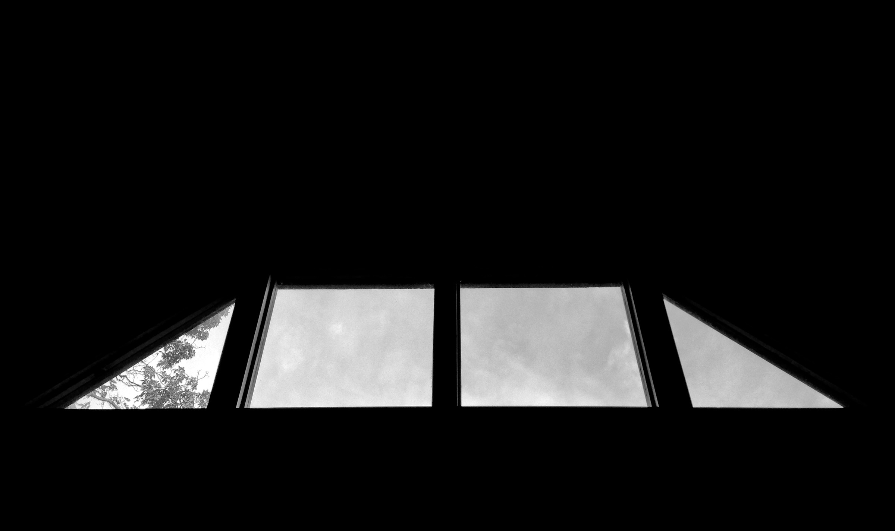

# Home


## Singing Trees

```
So far smears of gold and
smoky orange—
then shocking red
before the shed.

I take a selphie or two for you
on our deck in their midst.

Leaves exploding with color
like thoughts inside my head,
they too begging to be shed.

When winds meet our ridge they're

singing trees

and they're swaying at their
tree knees just like the way

I do
for you—
the way
that
you do
to me
too.

I glance out there and
watch them belt out a tune
about the seas and the breeze,
about the stars and the moon.

Shaking off color for this

time

that you will gradually
learn to appreciate with me.

Sounding like all the fine
music you have shared with me,

I am here, a native
ready to ease you
into cold songs by
singing trees

with warm arms
holding onto you
until feeling
what I mean
and the leaves
return to green.
```

## My Spot

```
The Earth will occasionally
graciously agree

to spend a little time with me

sitting next to an ancient
oak tree

at my spot.

With sweet breeze blowing through
the leaves of that tree
my focus will often wander

to thee.

Breaths refocus and gently remind
the primary purpose of spending
this time at my spot is to lose

every thought.

Easy said.
Hard done.

Calming a notion of you
as it charges my stormy brain
requires a mental discipline
I have yet to attain.
```

## On Top of Mountain Town

```
From passing the spot
where I wore yellow shoes,
to the summit

smiling inside and reaching
for our fluid dynamics
outside.

Then across a fallen tree
a flow rises swirling
from you plus me.

We are new to such
a public display
but our animal instincts
are come what may.

Slight alarm when others
close in to admire a view

so we slow our flow and
begin to lay low.

We are not camouflaged
but they do not know
we are away
but only for a
stone's throw.

This is the excitement
we yearned to know.

This is our nature.

Once was not enough and
these grounds become

our zoo

as though Mother Nature
is almost surprised when
she plays host to our

one made of two.
```

## Public Eye

```
We temporarily departed from civilization
on July fifteenth, two-thousand and fourteen.

On a sandwich of concrete smack in the middle
of downtown

we found

our resolve to carry through the plan.

(and check one more glorious thing off our list)

In daylight beyond broad,
we're at the very top
and we're colliding
like two comets in a china shop.

We are street animals for the longest moments,
detached from everything but our element and
flowing always flowing
two bodies of water forever.

We course through and through each other slowly
and deliberately, pausing to gaze into surprised
looks— yes, we are really doing this

here
and
now.

Yes, we are beautifully realizing
our time in this endeavor of love.

Thrilling to get away with it,
encouraged naturally
to want so much more.

We will recall this perfectly
animalistic shedding of all
decency and smile on forever.

The wild connectedness of

our love shone in public

in but one of many summer moments.
```

## Walk the Line

```
Red webbing tight between trees
and a summer's day,
with my arms held wide and you
making your way

across.

I cannot express how proud I am
that your nervousness gave
way to sexy strut

as you walk that line.

Damn, woman— you are so fine.

Step by step you rush my
heart and then into my arms.

For days and weeks and months
we feed from each other's charms.

Positivity.

Belief in the power of

you and me

remaking a journey anew and
setting ourselves free.

The ebb of life surges back to reveal
that we're all twirling on the wheel

Pain is just a couple wedges over
from perfect pleasures
and these moments.

Walking so nice down that line
until gravity imposes a fine and

what happened next is what we
generalize today as "drama".

Slight missteps and forces of nature
reach out to hurt my pretty mama—

to challenge us for the evening
with hurt and mending
and handwringing apologies.

We emerged still in deepest love
with more firsts under belts
and stronger than ever.
```

## Music on Our Roof

```
Your assurance
that I am not
alone feels more
genuine than any
I have ever known.

Reinforced by gentlest
percussive orchestra
tickling
tapping
trickling
knocking
murmuring
above—

Music on our roof,
cold October rain.

Music on our roof,
we both wait again

until we become
inextricable
warm pretzel
people beaming
in our
entanglement

under our covers
under our roof.

As gentle playing
gives way to heavy
water parting
earth crumbling
bone crushing
driving rhythm,

and we get
so down
to the sound
of

music on our roof.
```

## Bistro

```
On the interrelation of
years, months & d a y s . . .

For years—
    intending to have a
		taste and try this
		place otherwise, we
		arrive and flow right
		through.

In months—
    we have gone from
		divergent paths through
		space and time only to
		find our way back
		to each other.

For days—
    we meet these ways and
		amaze ourselves with
		a list that will never
		be completed.

Dining with you on this night
felt like being warmed by a
tiny sun sitting just feet
away and shining for
a million miles.

You made the evening special,
utmost grace and enchantment
during every single minute—

Your looks,
     those looks

loop in my mind
tracing smiles
reminding me of
a cherished gift.
```
