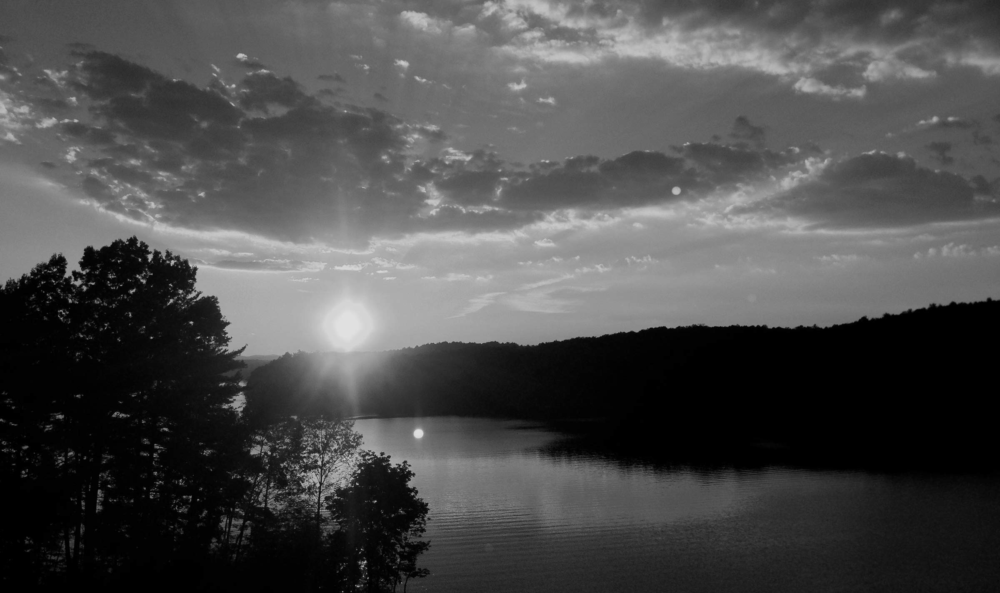

# Lakes


## Paddle Out

```
I wanted to imagine us

natives

traveling to a

peaceful someplace—

always with me behind you
amidst mountain and water,
but entirely fixed on a
different view.

Your back muscles
choreographed with arms
flexing at shoulder and elbow
as you delicately paddle.

I dug every bit of you
as I dug at the water too,
and we glided over that
tiny lake together.

Then you took a break,
my lovely Lake in a lake
and laid on me as
an easy chair.

While I paddled as
romantically as possible.

Strangers noticed and
yelled out accusations:

"You have her spoiled!"

prompting me to think:

'You're damned right I do.'
```

## Porch Swing

```
What
		could be cold and loathed
		moments leading up to tests
		turns out warm and calm with
		magnetic pants joining us
		at the hip
		to embrace
		away last fleeting
		hours
		smiles, laughter, intense
		gazes

		(and deftly snagging selphies)

Where
		white painted wooden swing
		of the typical porch variety
		nearly perfect in all form,
		but placed with an awkward
		view of the principal lake
		of my primitive home town

When
		on a late September afternoon,
		thick in southern humidity
		with critters and bugs and
		white wool woven pale topaz
		lounging above
		drawn drapes of sky
		covering outer space

Why
		twist of fate
				on the sixth of May
				my heart
				and brain
				were ceaseless
				with reminders
						over twenty-five years
						to stop everything and find you
		found as we are
				this day required your return to
				seven-hundred and one miles away
		however and come what may
		we are fond of shimmering
		while gazing upon each other
		when we say

				"We will be."

How
		imported into my moments
		spirited via silver wrapped
		all wheel drive fossil fuels
		smiling and radiant like Alpha Centauri
		our faces upon first soulful sight,
		until we engage dat everlasting hug
		    leave airport
				travel north
				travel west
				toward that Blue Ridge
				onward then again into last moments—
		to the lake,
		to the Lake.

Who
		water & water
		70s & 70s
		cardinal & fixed
		country girl & country boy
		hazel eyes & brown eyes
		complicated robot & careful mermaid
		art & science
		before & after
		lover & lover
		space & time
		husband & wife
```

## Dinnertime

```
Humble pizza and sparkling view,
this was one dinnertime with you.

Talking about
the old and the new,
please times like these
just never be through.

Enjoying each second
with a simplicity expert
alert, awake, and alive.

Modest though our means,
the end is peace
with each other
previously unknown
with another.

When together in moments,
I cannot fathom the source
as we sit confidently
becoming

a map of contentment.

Concentration on mindless
state, we are Zen archers
born of Cupid

and our aim never falters.

Porcupine hearts bristling
with shots of perfection,
our satisfaction
and satiation
only secondary

to our connection.
```

## Body of Water

```
Mermaid swimming within self—
a body of water surreal.

Start with your eyes since
I am motivated by primal
desires to that feature.

Warm brown caramel coffee
galaxies resting beneath
sharp showcasing sable brows:

I chart a course through such
stellar destination!

Your lips are satin pillows
of the kind I want to feel
pressed against any and
all of me forever.

The small of your back...

When the weather is really

HOT

    I feel a

        TINY LAKE

    of sweat

evaporating from there.

Surefire recipe to giving
me a heart fever every time.

Your small feet are beyond
cute ad delicious,
connected to lovely legs
leading to entirely
something else—

My kingdom for that ass.

From your navel to nipples
and every succulent form
in between,
your are a living statue
and the queen of my dreams.

You are adorable, precious,
    but intensely

        HOT AND FINE

    like the mist
from a geyser.

My sexy mermaid dynamo
with loveliest flowing locks
framing the sweetest smile
and covering delicious ears
I gnaw on for miles.

You're absolute hot liquid
flowing through my every pore

settling in the depths of
my spirit,
all of you mine to adore.
```

## Interstate Seventy Seven

```
Leaving sight of Queen Charlotte
on our way to hills and mountains,
we will reach that familiar stretch

with bridges and lake times two—
shadowy masts jutting prizes of
slightly swirling sailboats in water

  'We can be here someday
   on one of these boats'

I must remind myself of this hope
to sail fresh simple lake waters
with you; call it practice runs.

Just to have that time aboard
as a team of two lovers
working together as we do
overcoming odds
playing hard too,
and waking up anchored
right next to you

Overflowing senses
from swimming in
your sunshine
and I barely
pay it mind
on these
drives,

but that

    LAKE

keeps me needing.
```

## Hidden Water

```
The sign said a pond
would greet us.

So we hiked.

Water we searched—
as it is our essence
and true nature.

We sought with legs
and feet and brains
soaked with self made
chemicals

(the good stuff)

chatting and laughing,
I plead for you to lead
as I deeply enjoy
that view of you.

Getting that eyeful
of your purposeful
powerful walking
is enough to keep
me forever
behind you.

So we strolled and soaked
in the July sunshine while
eye high in brush
on a tiny deer trail.

Seemed like days went by
until we found ourselves
in circles

seeking water
seeking water

always seeking water.
```

## A Place for Us

```
Sometime soon
we will sail

in shifty winds
guarded by green mountain tops.

Serenity in the clouds can
be ours just minutes away
and these dreams play back

     in my head all day.

Lake in the clouds
bring us our energy—
water for you and for me.

Paddling, swimming, and fishing.

Laid back sunshine rendezvous,
talking with you for hours and
sharing our special powers.

Oh, how I long to see you as my

    Carolina mermaid and
    my mountain piratess

sharing every wet moment with me
swimming in my heart all day.

This will be a special place for
us to love and live and play.
```
