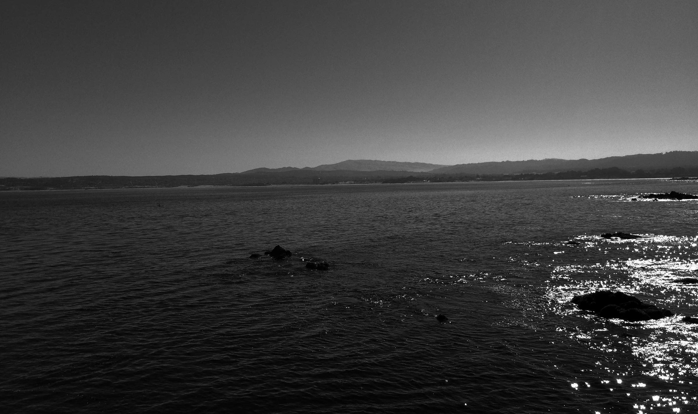

# Oceans


## Sand Castles

```
How can photographs
evoke such undertow
that snags me from
shallow and mellow
and drags me through
the breakers?

Where pulsing of
every liquid jet
comes crashing with
my heart drumming
an implosion song.

The beats quickening
on and on and on
until the salt of
ocean and my eyes
are one.

A sunny day for us
in the sand is all
sweetest smiles and
windy hairs twisting
while kissing.

You're like a luscious
pretzel wrapping and
forming your slinky
svelte form around my
own until we must
collide.

A day at the beach
with a dream in my
arms.

What I have lived
already beside you,
in minutes we wished
were months—

I would happily call
a lifetime.
```

## Sailor Mate

```
Our adventurous day
was no work and all play
until I dropped a monkey wrench in.

Challenged with impromptu journey,
you didn't bat a pretty warm eye—

so we cast off together
inviting storms to weather,
seven hundred and one miles?

Whatever.

In those hours we
re-learned reliance and trust,
our lives in each other's hands.

Between here and there a few
states to share love and
laughter and smiles—

both driving diminished and
fighting to be finished

fell in and out of the living

with rainbow orbs at daybreak
in the land of ocean and sand.

We co-captained a voyage
to be proud of,

a means to finality
conclusive closure...

an end from which
we could begin.
```

## The Fort

```
We traveled all night
proving teamwork that just works
until the sun peeked up off the coast.

Seeing you through subtle
fits of consciousness,
as co-pilot I have needed the most—
determined and willing
compassionate and kind

constantly blowing my mind.

We touched down in The Fort
with moments to spare,
frantically washing ourselves—

your time had come to resolve.

The course of your
sweet determined action
would result in

an unmarried girl.

I watched you glide
out of sight
like a marching spirit,
loving every second.

I waited waited
meditated
communed with the sunlight
while casting glances to
the point of your return.

I'd be a liar to say I didn't
celebrate this downtown day
and delight in your

duties of dissolution.

Your willpower proven until
you were all walked out
at the end of that worn road
and the beginning of a new one.
```

## Islands and Lighthouses

```
A future of ferry boat rides
and lighthouses is what we
have soon in store.

Another coast you've yet to
know, is waiting for us
to explore.

We have pirate lore and the
airplane legacy plus sunshine
and saltwater to fill days.

Finding ourselves there
in a dream to share and
something grand from our list.

I am often looking towards
those Carolina shores
and amazing first sunrise kiss.

We'll know a little island to
love with beaches just for us

(and more to check off our list!)

I've talked it up, but when we
are there you'll soon know all
that you've missed.

Spring cannot come soon enough—
let's get our selves ready now.

This part of the ocean will thrill
you anew and I cannot wait to show how.
```

## Same Day

```
Like dreaming, there we were in
a coast allegedly full of treasure.

(hint: you were the only treasure)

Casually running
as you daily do
for simple things,
for errands,
and for food.

A visit to learn about healing from
our acrobatic antics that put you
into the unknown,

unexpected first result:

    blue cast on your arm
    covering broken bone.

Love was a little bit nervous
that day, but no matter the place
where my body may lay,

my heart has to stay—

with you.

It was pleasure to be part
of your completely unusual
average day.

It was unfortunate to be
caught as we were and
anger away as it did

    We meant no harm
		to anyone and you
		know as well as I

Sharing no matter conditions...

drunk on love is my best excuse
and for you I could be talked
into anything.

    (please not just anything)

Throughout this time it was
walking the eggshell line,

but day to day, we will do just fine.
```

## Abyss

```
Somewhere under the Mariana Trench
is the depth of my love for you.

Born of the clouds and stars,
and rules over you like Mars;

we're co-owners
with a codeword
and we'll collide
until it needs
to be screamed.

Freedive with me where
it's too dark to see, then
we'll shed our Earthy bodies
and reside in galactic oceans

riding currents of the heart.

Light from our soul portals
warms freezing inky silk
overpowering negativity.

    BEAMING NONSTOP

We can face the abyss together
and gain freedom from the
duality it contains.

Nice to ride depths of this flow
with a cosmic mermaid
who's so in the know
when it comes to shared feelings.

Trust crucially
safety will follow naturally
spice and burning hot fireworks
which still ignite underwater.

At these depths we are
delirious without darkness...

We are shuddering
We are stammering
We are shivering
We are screaming
We are smiling

We are making those noises again.
```

## North and South

```
Exhausted afternoon, seven-hundred and one miles
leaving us wrapped in uncertain haze spiked with
love gifts.

Excited closure to your unexciting past
mixed with sun and sand,
our desperately needed eternity.

but togetherness more than a day,
was abruptly stolen away.

Sent gently packing up ninety-five eyes,
you going south
and me going north—

not an ideal surprise.

Could see nothing in your sunglasses
when you turned your head and
I mouthed "good-bye".

At eighty miles per hour:

Screaming for hundreds of miles,
wanting to tear apart everything
and blame anything for this
tiny mobile hell.

I needed again to be whole with you.

Instead, I'd been shown
    a stunning bouquet
        of flowers
            from another world
                only to have them
                    thrown

                           off a cliff


with but one

alone

going back to no home.
```
