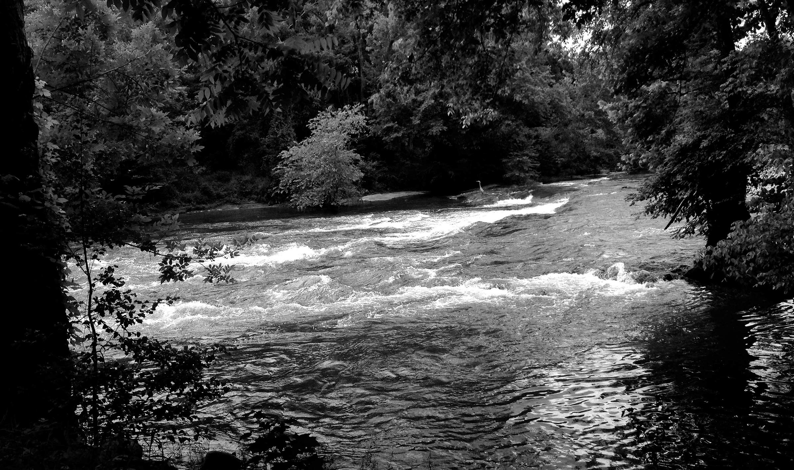

# Rivers


## Chauffeur for a Race Car Driver

```
I was nervous in the notion
of fetching one so fetching
but quite convinced
that you have always been
mine for the longest time.

Here we are in June,
just one month after reunion

on a course
     of inevitable collision.

Making up for unknown decades
with my strongest of lures—

The drawing and the words,
then you coined "selphie"
because you are more clever
than you know.

We shared those too and
months compressed into
days until:

I casually skip into


           ARRIVALS


at Raleigh Durham International,
I prepare my chauffeur placard:


           ANDRETTI


Our inside joke and also a touch
of unnecessary confirmation.

For when I know that you are at
your gate, my heart is run through
by feverish electricity and begins
to skip and short circuit and freak
the fuck out.

I know that you are a professional
race car driver, just like your
daddy says when he calls you one.

I know that you can wickedly drop
down into second gear then
cause metal to fight metal
in the howl of machinery
while rubber duels with asphalt
amidst banshee shrieking and smoke—
you are utter coyness sliding sideways
into a cloud of dust and spent tire,
touching ever more a barrier shaped
just like

            MY HEART.

I know that you are a fast driver
with butterflies and lightning bolts
somersaulting in your belly—
the same as when me and you
slip again into something anew.

Just as you pull out of the pack,
I see you emerge from the crowd;
You see me, your humble nerdy driver—

our eyes are locked
and you are smiling
and I am smiling
and in seconds we have closed the

                         distance.

Reunited and touching one another,

and I just know that I would drive you

anywhere.
```

## Bedside Manner

```
We carried animals
into the bedroom
high on each other
expecting another
time like the last.

Inside us both,
sheer wilderness
howling and clawing—
edging closer to
violence of adoration
and collision of
being.

Check the smoke detector!

We must not disturb
the neighbors with
our fireworks inferno.

I tightly seal your mouth
with one palm and pull you
closer
closer still
and we burn like this
quietly raging all night long.

Before I know it, our heat
and exploded senses are
en route to consume us.

You are there now at the edge
neck snapped back and begging
as though to be pierced
by savage teeth and sharp claw.

Quietly quietly, I give you all
of myself as a gift you have
burned and longed and ached
to receive.

You

are at the edge of our bed
and you want to consume us
and you have already absorbed

Me.
```

## A Toast

```
Saturday evening sneaks in
gloriously with a script

    (or perhaps a list?)

We have such a dynamic
temporary back yard tonight—
a teasing and rushing river
directly outside our window

due to an oath to each other:

    WATER EVERYWHERE

There alongside the charging Neuse,

lounged you and I under low light
with a small bottle of cognac.

    (to check off our list)

Perfumed spirits new to each of us
as we are almost new to each other,
we embark on this sweetened kissing
odyssey together

with a toast.

I gently coach you with the basics
of enjoyment, telling you to warm
your hands for the glass,
smell the aromas and to
chew on your sip just a bit.

It is our smiles in this moment,
which are sweeter still than any
external force or suggestion.

We have the best time
talking and smiling
smiling and talking
wanting to remain
found in each other's eyes.

In these times
I come to know that
that between you and me—

we will be.
```

## Quiet Town

```
How about that mission?

Simple on its face:

    morning coffee?

We walked in eerie quiet
through unsettling tidiness
and rare stares—
with a mouthful of questions:

Was this town not open today?

Where is everyone?

Do you have a
creepy feeling
that we're
being watched too?

Still, we did our thing,
we walked hand in hand
bouncing summer smiles
off each other and sharing
the most enormous small talk
of my entire life.

After fumbling and shuffling
in our best of style and nearly
thwarted by a smart telephone,
we were rewarded with caffeine.

The quiet was intense enough to
leave us feeling as though we
were not in on the joke.

We nervously hightailed back
to our river place and agreed
to seek future coffee elsewhere.
```

# Our Ride

```
Did we make a movie moment
in your mind?

A dreamy enough collection
of hugging on wheels to
turn anyone's head and
cause similar conclusion:

		L O V E B I R D S

		       on

		L O V E B O A R D

We took a gentle enough dip
through a quiet parking lot
suavely swooped and swooshed
tightly coupled fluid moves

and yes it did fell like a
movie or a dream.

A dream of flying together,
fueled by love and pleasure
we found down by the river.
```

## Water Everywhere

```
We knew from the get go
once we compared our
H times 2 and the O...

Two waters that are so down
and always good to go.

Nowadays if someone told me

"go jump in a lake"

I'd ask them to first
please capitalize "Lake"
and then tell them
that I jumped into you
a long time ago.

Just so they know.

Come now, and trust me to lead
you by your pretty little hand
to the river's edge.

We're gonna walk
into the currents
and become one with our element.

Recall:

current pulled hard and
 encouraged us downstream
  and we slipped a little,
   we resisted a bit
    and we stood
		firm together
   on slippery rock
 and shifting sand.

 We embraced as if awaiting
  a tidal wave—
   holding fast
  and loving tightly.

Kissed and kissed, begging for
space and time to freeze these
seconds into years.

Liquid and easygoing, we belonged
amid this beauty like a piece of
nature fixed into this broad river.

Water upon water and
water everywhere
a crab and a scorpion
without a care,
except each for other.

I found the other half of my heart
in that river, you found sweet
gentle safety and

we will be

never the same again.
```

## Floating Beside

```
We rested on worn woven ropes,
suspended above the ground and
touching from skin to soul

Relaxing reflection

on

    rapid reunion

kept us floating beside.

We firmly held moments
under Carolina sun

our sighs heavy and thick,
mimicked nearby river currents

the opposite of wild
amusement park rides—

we were floating beside.

Such slow and simple joy
never felt quite like this—

feet touching, arms wrapping
sharing safely the currents of

our bliss.

Both hearts and faces left
smiling a thousand miles wide—

as we lay floating beside.
```
